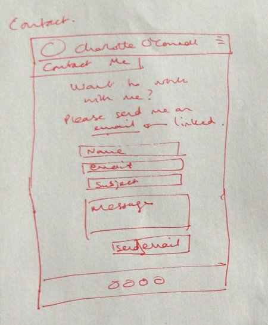

# Charlotte's Web
## First Milestone Project - User-Centric Frontend Development

This is my personal profile website which I can present to prospective employers or convert into a blog. The profile showcases my employment and educational history, the software experience I have, along with a few GitHub projects I have done which I will update with more up-to-date projects when I have completed more. I have also got a landing page with a short section about me, and a gallery page which showcases some photos I've taken in my travels. Finally, there is a contact page which allows the user to send me an email directly.

## UX
This website is designed to appeal to both potential employers and personal viewers. 

#### Strategy
For potential employers, there must be employment and education history showcased which is shown primarily in the Résumé page. This needs to appear as professional as possible and in an easy-to-read format. 
For personal viewers, I wanted to create a friendly environment to view which would make the viewer want to share the website, or to continue looking through this. In order to achieve this, I wanted the personalised landing page and gallery as extras to a standard personal website. 

#### Scope
Key features to include are a drop down navigation bar which is collapsible for smaller screen sizes, to create a sleeker look. Extra features are to let the users know where the photos in the gallery are taken should they also want to visit. Another feature is linking the résumé page to my GitHub repositories.

#### Structure
All pages to have a standard footer and header in the colour theme chosen. 
Grouping the pages in four pages of:
- Home page with a small section about me 
- Experience page with work and education history and GitHub links
- Gallery page with some photos
- Contact page with form to contact me via email 

#### Skeleton
I created an original skeleton page using the Balsamiq software which was then modified after the preliminary discussion with my mentor. The latest version of the skeleton can be found [here](https://balsamiq.cloud/sen1h0s/p2g4sax). 
In addition to this, to have a more simple working base, I hand drew some very simplistic schemes. 

These simplistic schemes can be seen here: 

#### Surface
The dark colour scheme with orange was designed to feel modern yet chic for both employer and personal users. 

## Features
The majority of my website is built upon the grid system within Bootstrap, especially using the flex functionality. 
JavaScript and JQuery additions to Bootstrap allowed me to have a smoother drop down box which was collapsible for smaller screen sizes. 
Font Awesome icons were used for the footer links. 

### Futher Features To Implement
To have any invalid entries into the form in the contact page flag as being invalid. 
To have a downloadable CV within the résumé section of the website, and potentially in the navigation bar.

## Technologies Used 
- HTML 
- CSS
- Bootstrap 4.3.1
- Font Awesome 4.7.0
- JQuery
- JavaScript 

## Testing
Testing was carried out using an array of different browsers (Chrome, Safari) and different sizes of mobile devices to check for responsiveness. 
The main issues occured with the dropdown menu, which was fixed using more intricate CSS and a different hamburger menu idea. 
On smaller devices, the main viewport photo was not centred, so this was fixed using the "background" control in CSS. 

## Deployment 
This website is hosted via GitHub pages, which is deployed directly from a master branch. This allows for live updates to be applied using new pushes to the repository. 

## Credits 
### Content
All content was written by me within all sections of this website. 

### Media
All media is taken from my personal collection of photos taken during my holidays and those taken of me from family collections.

### Acknowledgements
For the base information to create the flex system, I used [this page](https://getbootstrap.com/docs/4.0/utilities/flex/) as a reference.

To make the gallery stand out and be user friendly, I wanted to overlay where the photo was taken so the user could use this information. For ideas on how to create this, I used this [tutorial](https://www.w3schools.com/howto/howto_css_image_overlay_title.asp).

On my contact page, I wanted to make sure I could physically send emails from the page to my account, and to create this functionality I used [this](https://css-tricks.com/all-about-mailto-links/) tutorial. I then checked from different sources if I sent an email to myself, which I did do.

The dropdown feature that is collapsible I styled similarly to the "Whiskey Drop" tutorial done in the User Centric Development Module and can be seen [here](https://github.com/CharOConnell/whiskey-drop). This feature uses JQuery and other JavaScript features, taken from the Bootstrap JS CDN. Also, I used information about the navbar-dark from [here](https://getbootstrap.com/docs/4.0/components/navbar/) when styling the navigation controls.
There were several issues which I came across with the navigation bar, but after a discussion with my mentor, it seemed suitable to try and create something similar to the hamburger menu which is demonstrated [here](https://www.w3schools.com/howto/tryit.asp?filename=tryhow_js_mobile_navbar).

Font awesome icons were used for my footer icons. 

